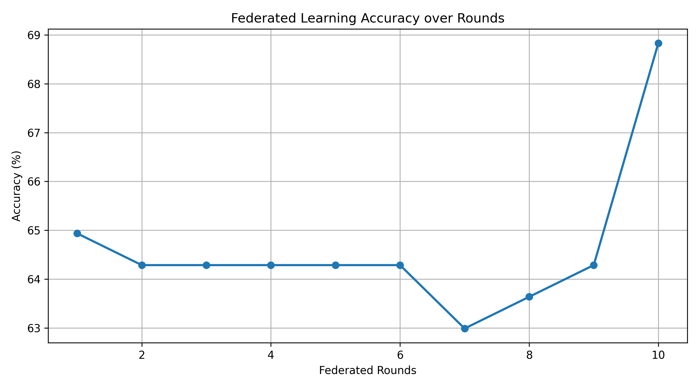

### Privacy-Preserving Federated Learning on Healthcare Data

This project demonstrates how to use **Federated Learning (FL)** to train a privacy-preserving machine learning model on **healthcare data** (diabetes prediction), using the **Flower framework** and **PyTorch**.

Instead of sending raw patient data to a centralized server, this project enables multiple clients to **collaboratively train a model without sharing their data**, preserving privacy and data security.

---

## What is Federated Learning?

**Federated Learning** is a machine learning approach where:
- Multiple clients (e.g., hospitals, devices) train a model locally on their private data.
- Only **model updates (weights)** are shared with a central server.
- The server **aggregates** these updates to improve a global model.
- **Raw data never leaves the clients**, ensuring **data privacy**.

Federated Learning is ideal for **sensitive domains** like:
- Healthcare
- Finance
- Mobile devices

---

## Project Overview

| Feature | Details |
|--------|---------|
| **Task** | Binary classification: Predict whether a person has diabetes |
| **Frameworks** | PyTorch + Flower |
| **Privacy** | Raw healthcare data stays on each client |
| **Model** | Feedforward Neural Network (3-layer) |
| **Training** | Federated with 2 simulated clients, 10 rounds |
| **Evaluation** | Accuracy is aggregated from all clients |
| **Visualization** | Global accuracy vs. training rounds plotted after training |

---

## Dataset

We use the **Pima Indians Diabetes Dataset** (`diabetes.csv`), which contains medical diagnostic data for female patients.

- [Kaggle Dataset Link](https://www.kaggle.com/datasets/uciml/pima-indians-diabetes-database)
- Features: `Glucose`, `BloodPressure`, `BMI`, `Age`, etc.
- Target: `Outcome` (0 = No diabetes, 1 = Diabetes)

---

## Project Structure

```

.
├── model.py               # PyTorch model definition
├── utils.py               # Data loading & client data splitting
├── server.py              # Flower server with accuracy plotting
├── client.py              # Flower client with local training
├── diabetes.csv           # Dataset file
├── federated\_accuracy\_plot.png  # Generated after training
└── README.md              # You are here 

````

---

## How to Run

> Make sure you have `diabetes.csv` in your project folder.

### 1. Install Dependencies
```bash
pip install flwr torch scikit-learn pandas matplotlib
````

### 2. Start the Server (Terminal 1)

```bash
python server.py
```

### 3. Start Client 0 (Terminal 2)

```bash
python client.py
# Enter: 0
```

### 4. Start Client 1 (Terminal 3)

```bash
python client.py
# Enter: 1
```

> Training will run for 10 federated rounds.
> A graph showing **global accuracy vs. round** will be displayed after completion and saved as `federated_accuracy_plot.png`.

---

## Output Sample



---

## Why Federated Learning?

| Traditional ML                 | Federated Learning                        |
| ------------------------------ | ----------------------------------------- |
| Centralized data storage       | Data remains on client devices            |
| Higher risk of data leaks      | Improved privacy and compliance           |
| Requires large central dataset | Enables collaboration across institutions |


---

## References

* [Flower Framework](https://flower.dev/)
* [PyTorch](https://pytorch.org/)
* [Federated Learning Paper (McMahan et al.)](https://arxiv.org/abs/1602.05629)

---

## Author

**Muhammad Asim Hanif**
